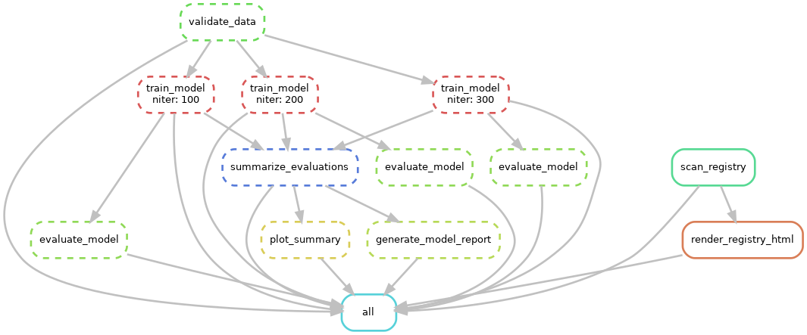

# SNPTX

## Connecting Data to Discovery


---

### What Is SNPTX?

SNPTX is a deterministic orchestration framework for reproducible biomedical machine learning. It separates pipeline execution from analytical interpretation, enforcing artifact-driven interfaces between a narrow, stable core and a governed extension ecosystem.

Unlike conventional MLOps assemblies that bundle tracking, orchestration, and analysis into a single monolith, SNPTX treats the boundary between computation and interpretation as an architectural first principle. The core framework controls what runs and when. Extensions control how results are interpreted — never how models are trained or selected. This separation is not a convention suggestion; it is enforced through contract-driven execution, owner-mediated invocation, and auditable artifact boundaries.

The system is designed for environments where reproducibility is not optional: clinical research pipelines, regulatory-adjacent workflows, and multi-collaborator biomedical analysis where provenance and determinism must survive across teams, institutions, and time.

---

## Technical Architecture

### Core Framework

The SNPTX core is intentionally narrow. It is responsible for four concerns and no others:

| Component | Role | Implementation |
|---|---|---|
| **Pipeline Orchestration** | Reproducible DAGs from ingestion through evaluation | Snakemake |
| **Experiment Tracking** | Parameters, metrics, artifacts, and model versions | MLflow |
| **Artifact Management** | Dataset, model, and derived artifact versioning | DVC |
| **Configuration & Lineage** | Explicit control over datasets, features, and parameters | YAML-based configuration |

The core does not embed analytical logic beyond basic evaluation. Interpretation belongs to the extension layer.

### Extension Governance Model

Tier-1 extensions form the collaboration-ready analytical surface. All extensions:

- Are **strictly downstream** of the core pipeline
- Consume and produce **artifacts only** — no shared state, no runtime coupling
- Are **invoked exclusively by the SNPTX owner runner** — direct execution is forbidden
- Must declare **explicit input and output contracts** with typed schemas
- Produce **deterministic outputs** — identical inputs yield identical results

Extensions live in a separate repository (`snptx-extensions`), physically isolating analytical contributions from orchestration and training logic. Contributors propose modules; execution remains owner-mediated.

### Artifact-Driven Flow

```
Upstream Training → Evaluation Artifacts → Diagnostics & Normalization → Canonical Aggregation → Reporting
```

Each stage emits persisted, immutable artifacts that serve as the sole interface to the next. This prevents tight coupling and enables independent verification at every boundary.



---

## Technical Differentiation

SNPTX is not a wrapper around MLflow, nor a Snakemake template, nor a DVC pipeline with documentation. The following properties distinguish it from standard MLOps tooling:

**1. Execution–Interpretation Separation**
Most ML frameworks treat model training, evaluation, and reporting as stages in a single pipeline. SNPTX architecturally separates the execution domain (core) from the interpretation domain (extensions). This boundary is enforced through contract validation, owner-mediated invocation, and physical repository separation.

**2. Contract-Driven Extension System**
Extensions declare typed input/output contracts (`extension.yaml`) that are validated at runtime. The owner-runner generates deterministic run IDs, captures logs, and produces auditable manifests for every extension invocation. This is not a plugin system — it is a governed collaboration surface.

**3. Artifact Immutability as Architectural Constraint**
Artifacts are immutable once written. Downstream components consume artifacts, not code. Provenance is preserved through lineage, not inspection. This enables deterministic replay and independent audit.

**4. Deterministic Orchestration**
Pipeline execution uses fixed seeds, versioned configurations, and reproducible DAGs. The system is designed so that identical inputs produce identical outputs across runs, environments, and time.

---

## Market Opportunity

### The Reproducibility Gap in Applied Biomedical AI

The reproducibility crisis in biomedical research is well-documented. Computational workflows in genomics, clinical prediction, and drug discovery routinely fail to reproduce across labs, institutions, and time horizons. Existing MLOps tools solve deployment efficiency but do not address the structural causes of irreproducibility: uncontrolled analytical drift, implicit state dependencies, and the absence of governance over downstream interpretation.

### The Need for Structured Evaluation Frameworks

Regulatory bodies, institutional review boards, and pharmaceutical partners increasingly require auditable ML pipelines with clear provenance. The current tooling landscape offers tracking (MLflow), versioning (DVC), and orchestration (Airflow, Snakemake) as independent utilities. SNPTX integrates these into a single framework with architectural enforcement of reproducibility constraints.

### Deployment Opportunity

- **Pharma and biotech R&D pipelines** requiring auditable, reproducible ML workflows
- **Academic research labs** conducting multi-site, multi-collaborator computational studies
- **Clinical AI development** where regulatory submission demands full pipeline provenance
- **Consortium-scale projects** where multiple teams must contribute analysis without compromising execution integrity

---

## Growth Strategy

### Phase 1: Research Lab Deployment
Establish SNPTX as the orchestration layer for reproducible biomedical ML in research environments. Demonstrate value through deterministic execution, artifact governance, and structured collaboration.

### Phase 2: Controlled Extension Ecosystem
Expand the Tier-1 extension surface to cover cohort analysis, explainability, and intelligent summarization. Maintain strict governance: all extensions are downstream, artifact-only, and owner-mediated.

### Phase 3: Enterprise Modularization
Package core and extension capabilities as composable modules for institutional deployment. Support multi-team, multi-dataset, and multi-modality workflows through configuration rather than code branching.

### Phase 4: API and Deployment Expansion
Expose deterministic artifacts through read-only APIs. Build dashboard interfaces backed by canonical outputs. Enable external consumption without compromising execution guarantees.

---

## Current Status

| Area | Status |
|---|---|
| Core pipeline orchestration (Snakemake) | Complete |
| Experiment tracking (MLflow) | Complete |
| Artifact versioning infrastructure (DVC) | Complete |
| CI validation (GitHub Actions) | Complete |
| Tier-1 extension framework | Complete |
| Calibration diagnostics extension | Complete |
| Metric aggregation extension | Complete |
| Evaluation summary reporting extension | Complete |
| Artifact contract validation | In Development |
| Cohort and slice analysis | Planned |
| Intelligent summarization layer | Planned |
| Interactive dashboards | Planned |
| API deployment layer | Planned |

---

## Architecture & Roadmap


For detailed technical architecture, see [ARCHITECTURE.md](docs/ARCHITECTURE.md).
For the development roadmap, see [ROADMAP.md](docs/ROADMAP.md).
For the extension governance model, see [DEVKIT_NOTES.md](docs/DEVKIT_NOTES.md).

---

## Repository Structure

```
snptx-public/
├── README.md
├── docs/
│   ├── ARCHITECTURE.md
│   ├── ROADMAP.md
│   ├── DEVKIT_NOTES.md
│   └── assets/
│       ├── snptx_architecture.png
│       ├── SNPTX_Project_roadmap.png
│       └── workflow_dag.png
```

This repository contains documentation and architectural specifications only. Source code, datasets, model artifacts, and execution scripts are maintained in private repositories.

---

## Contact

- drr508@g.harvard.edu
- dan@snptx.ai
