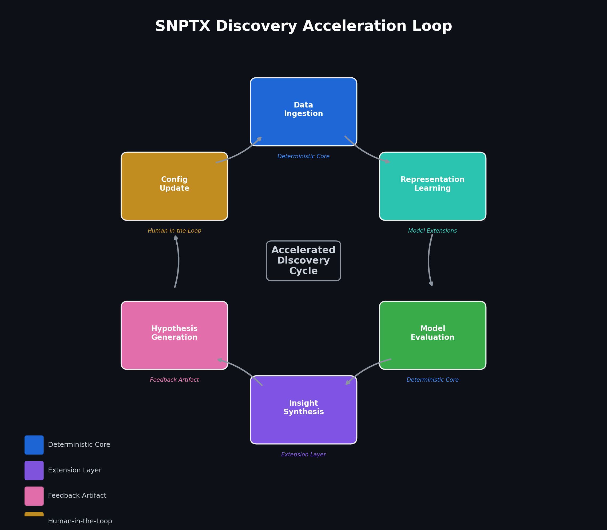
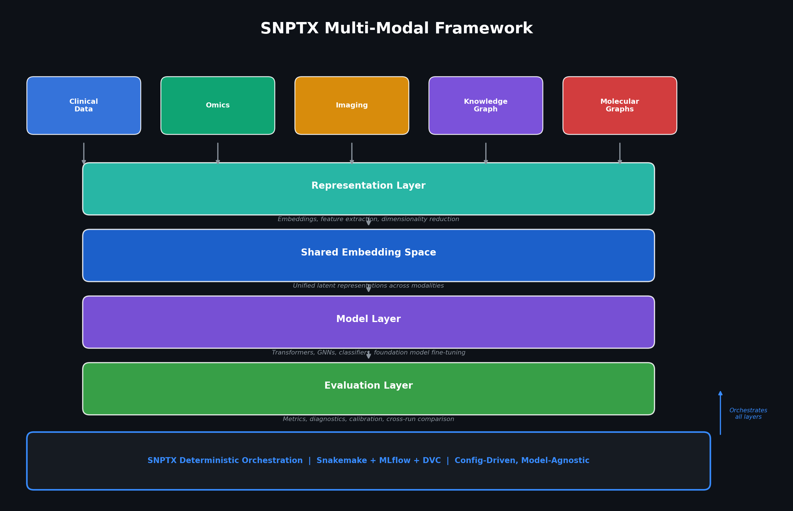

# SNPTX

## Connecting Data to Discovery

SNPTX is a deterministic orchestration framework for biomedical machine learning, designed to accelerate the path from raw data to reproducible, interpretable discovery. It provides the infrastructure layer that enables deep learning experimentation, multi-modal model integration, and hypothesis-driven ML iteration within a fully reproducible pipeline.



---

### What Is SNPTX?

SNPTX orchestrates the full biomedical ML lifecycle: data ingestion, model training, evaluation, insight synthesis, and structured feedback. It separates pipeline execution from analytical interpretation, enabling researchers to iterate on models and hypotheses without compromising reproducibility or provenance.

The core framework controls what runs and when. Extensions control how results are interpreted, compared, and synthesized. This separation allows deep learning architectures, foundation models, and multi-modal pipelines to operate within a deterministic infrastructure that guarantees identical outputs from identical inputs.

SNPTX is built for environments where discovery must be reproducible: drug target identification, clinical prediction, biomarker analysis, and multi-site consortium research.

---

## Multi-Modal Architecture

SNPTX is model-agnostic and modality-agnostic by design. The orchestration layer supports any combination of data modalities through configuration, not code modification.



| Modality | Example Applications |
|---|---|
| **Clinical** | Readmission prediction, survival analysis, cohort stratification |
| **Omics** | Gene expression embeddings, biomarker discovery, pathway analysis |
| **Imaging** | Histopathology classification, radiology feature extraction |
| **Knowledge Graphs** | Drug-target interaction, literature-derived hypothesis networks |
| **Molecular Graphs** | Compound property prediction, molecular similarity search |

Each modality feeds into a shared representation layer, enabling cross-modal comparison through standardized artifact interfaces.

---

## Deep Learning Capability

SNPTX provides the deterministic infrastructure within which advanced learning methods operate at scale.

### Model-Agnostic Orchestration

The pipeline orchestration layer is independent of model architecture. Any model that accepts data and produces evaluation artifacts can be integrated through configuration. This includes classical ML, deep neural networks, and pre-trained foundation models.

### Supported Architecture Directions

| Architecture | Application Domain | Status |
|---|---|---|
| **Transformer models** | EHR sequence modeling, clinical note embedding, omics feature extraction | Roadmap |
| **Graph neural networks** | Molecular property prediction, knowledge graph reasoning, drug-target interaction | Roadmap |
| **Representation learning** | Biomarker discovery, patient embedding, unsupervised phenotyping | Roadmap |
| **Multi-modal fusion** | Cross-modality prediction combining clinical, omics, and imaging features | Roadmap |
| **Contrastive learning** | Patient similarity, cohort discovery, representation alignment | Roadmap |
| **Foundation model fine-tuning** | Domain adaptation of pre-trained biomedical models within deterministic pipelines | Roadmap |

### Hyperparameter Search Integration

The Snakemake DAG supports parameterized sweeps across model configurations. Combined with MLflow experiment tracking, this enables systematic model comparison with full provenance over every hyperparameter combination.

### Embedding Registry

As multi-modal pipelines produce learned representations, SNPTX is designed to maintain an embedding registry: a versioned, artifact-driven store of embeddings linked to specific model versions, datasets, and training configurations. This enables downstream analysis to consume representations as stable artifacts. *(Planned)*

### Self-Learning Extension Roadmap

The extension layer is designed to support structured feedback from evaluation outputs back to pipeline configuration:

- **Cross-run synthesis** identifies patterns across evaluation histories *(Planned)*
- **Hypothesis generation** surfaces structured suggestions from accumulated evidence *(Planned)*
- **Config-driven feedback loops** enable closed-loop experimentation without violating determinism *(Planned)*

---

## Technical Architecture

### Core Framework

The SNPTX core is intentionally narrow. Four concerns, no others:

| Component | Role | Implementation |
|---|---|---|
| **Pipeline Orchestration** | Reproducible DAGs from ingestion through evaluation | Snakemake |
| **Experiment Tracking** | Parameters, metrics, artifacts, and model versions | MLflow |
| **Artifact Management** | Dataset, model, and derived artifact versioning | DVC |
| **Configuration and Lineage** | Explicit control over datasets, features, and parameters | YAML |

### Extension Layer

Tier-1 extensions form the analytical surface for downstream interpretation. All extensions:

- Are strictly downstream of the core pipeline
- Consume and produce artifacts only, with no shared state or runtime coupling
- Must declare explicit typed input and output contracts
- Produce deterministic outputs: identical inputs yield identical results

Extensions live in a separate repository, physically isolating analytical contributions from orchestration and training logic.

### Artifact-Driven Flow

```
Data Ingestion > Training > Evaluation > Diagnostics > Aggregation > Reporting > Feedback
```

Each stage emits persisted, immutable artifacts that serve as the sole interface to the next. This prevents tight coupling and enables independent verification at every boundary.

---

## Technical Differentiation

**1. Execution and Interpretation Separation.**
The execution domain (core) and the interpretation domain (extensions) are architecturally separated through contract validation and physical repository isolation. This allows model architectures to change independently of evaluation logic.

**2. Contract-Driven Extension System.**
Extensions declare typed input/output contracts validated at runtime. The agentic execution layer generates deterministic run IDs, captures logs, and produces auditable manifests. Agentic workflows can build and execute analytical modules without touching training pipelines.

**3. Deterministic Infrastructure for Experimentation.**
Fixed seeds, versioned configurations, and reproducible DAGs create structural conditions for reliable experimentation. This is the enabling layer for deep learning research where reproducibility is critical for both scientific credibility and iterative model development.

**4. Model-Agnostic, Modality-Agnostic Design.**
SNPTX does not constrain model choice. It provides the orchestration and artifact management within which any learning method, from logistic regression to transformer architectures, operates with full provenance.

---

## Market Opportunity

### The Reproducibility Gap in Biomedical AI

Computational workflows in genomics, clinical prediction, and drug discovery routinely fail to reproduce across labs and time horizons. The failure is infrastructural: uncontrolled analytical drift, implicit state dependencies, and the absence of structured evaluation frameworks.

### Drug Discovery Acceleration

Pharmaceutical R&D timelines are measured in years and billions of dollars. Structured, reproducible ML pipelines that enable rapid model comparison, hypothesis generation, and cross-modality analysis can materially compress discovery cycles. SNPTX provides the infrastructure layer for this acceleration.

### Deployment Opportunity

- **Pharma and biotech R&D** running multi-model, multi-dataset discovery pipelines
- **Research labs** conducting reproducible computational studies with agentic workflow automation
- **Clinical AI development** requiring full pipeline provenance for deployment
- **Consortium-scale projects** where multiple teams contribute analysis across institutions

---

## Growth Strategy

### Phase 1: Research Lab Deployment
Establish SNPTX as the orchestration layer for reproducible biomedical ML. Demonstrate value through deterministic execution, agentic workflow integration, and multi-model comparison.

### Phase 2: Deep Learning Integration
Expand pipeline support for transformer, GNN, and foundation model architectures. Build embedding registry and cross-run synthesis capabilities.

### Phase 3: Self-Learning Feedback
Implement closed-loop experimentation: evaluation outputs generate structured hypotheses that flow back into pipeline configuration through governed artifact channels.

### Phase 4: Enterprise and API Layer
Package capabilities for institutional deployment. Expose deterministic artifacts through APIs and dashboards. Enable multi-team, multi-dataset workflows at scale.

---

## Current Status

| Area | Status |
|---|---|
| Core pipeline orchestration (Snakemake) | Complete |
| Experiment tracking (MLflow) | Complete |
| Artifact versioning infrastructure (DVC) | Complete |
| CI validation (GitHub Actions) | Complete |
| Tier-1 extension framework | Complete |
| Calibration diagnostics extension | Complete |
| Metric aggregation extension | Complete |
| Evaluation summary reporting extension | Complete |
| Deep learning pipeline integration | Roadmap |
| Multi-modal data support | Roadmap |
| Self-learning feedback loop | Roadmap |
| Embedding registry | Roadmap |
| Interactive dashboards | Roadmap |
| API deployment layer | Roadmap |

---

## Documentation

For detailed technical architecture, see [ARCHITECTURE.md](docs/ARCHITECTURE.md).  
For the development roadmap, see [ROADMAP.md](docs/ROADMAP.md).  
For the extension development model, see [DEVKIT_NOTES.md](docs/DEVKIT_NOTES.md).  
For strategic positioning, see [POSITIONING.md](docs/POSITIONING.md).  
For market analysis and TAM, see [MARKET_ANALYSIS.md](docs/MARKET_ANALYSIS.md).  

---

## Repository Structure

```
snptx-public/
+-- README.md
+-- docs/
    +-- ARCHITECTURE.md
    +-- ROADMAP.md
    +-- DEVKIT_NOTES.md
    +-- VISION.md
    +-- POSITIONING.md
    +-- INVESTOR_BRIEF.md
    +-- MARKET_ANALYSIS.md
    +-- assets/
        +-- agentic_workflow.png
        +-- discovery_loop.png
        +-- extension_lifecycle.png
        +-- market_growth.png
        +-- multimodal_framework.png
        +-- positioning_matrix.png
        +-- self_learning_trajectory.png
        +-- snptx_architecture.png
        +-- SNPTX_Project_roadmap.png
        +-- tam_sam_som.png
        +-- workflow_dag.png
```

This repository contains documentation and architectural specifications only. Source code, datasets, model artifacts, and execution scripts are maintained in private repositories.

---

## Team

**Dan Russell** (Founder), MITx (SDS), Harvard ALM (DS) '27. Systems architecture, biomedical ML infrastructure.

drr508@g.harvard.edu  
dan@snptx.ai
