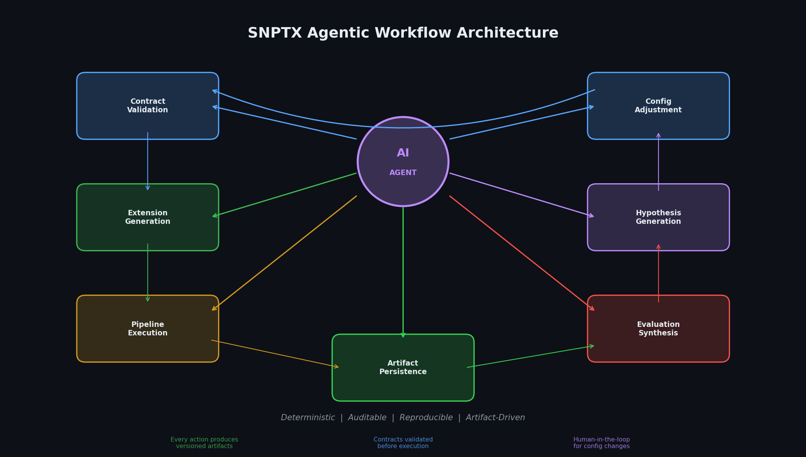

# SNPTX Architecture

This document defines the technical architecture of the SNPTX system: the core framework, the extension model, artifact flows, deterministic execution design, and the deep learning integration strategy that together enable reproducible, scalable biomedical machine learning.

---

## 1. Design Principles

SNPTX is built on six architectural commitments:

**Modularity.** Core orchestration and downstream analytical logic are strictly separated. Each extension operates as an independent, testable unit with explicit inputs and outputs.

**Reproducibility.** Data, models, and analytical artifacts are versioned. Identical inputs produce identical outputs across runs. This is a structural guarantee, not a best-practice suggestion.

**Determinism by Design.** Random seeds are fixed. Configuration state is explicit. Implicit dependencies are prohibited. This creates the stable foundation required for reliable deep learning experimentation.

**Traceability.** Every artifact can be traced to upstream inputs, configuration state, and execution context. Provenance is preserved through lineage metadata, enabling cross-run comparison and hypothesis validation.

**Model Agnosticism.** The framework does not constrain model architecture. Logistic regression, transformer networks, graph neural networks, and foundation models operate within the same orchestration layer.

**Extensibility.** New learning methods, analysis layers, and feedback mechanisms are added as extensions, not as core modifications.

---

## 2. System Layers


| Layer | Purpose | Implementation |
|---|---|---|
| **Data and Knowledge Ingestion** | Ingest, validate, and version raw datasets and derived features | CSV pipelines, DVC, cloud storage |
| **Core Framework** | Orchestrate pipelines, manage experiments, control configuration and lineage | Snakemake, MLflow, DVC, YAML |
| **Model and Learning Layer** | Train models across architectures and modalities | Model-agnostic, config-driven |
| **Evaluation and Diagnostics** | Downstream evaluation, diagnostics, and metric normalization | Tier-1 extensions |
| **Reporting and Synthesis** | Human-readable summaries, cross-run comparison, insight generation | Tier-1 extensions |
| **Feedback and Self-Learning** *(Future)* | Artifact-driven feedback, hypothesis generation, config adjustment | Planned extensions |

---

## 3. Core Framework

The core is intentionally narrow. It handles four concerns:

### 3.1 Pipeline Orchestration

Snakemake defines reproducible DAGs connecting data ingestion, validation, training, evaluation, summarization, and reporting. Each pipeline stage is an independent rule with explicit inputs and outputs. The DAG supports:

- Parameterized model training with configurable sweeps across architectures and hyperparameters
- Deterministic train/test splitting with fixed seeds
- Data validation against schema definitions
- Incremental re-execution when inputs or configuration change

### 3.2 Experiment Tracking

MLflow records parameters, metrics, artifacts, and model versions for every run. This provides:

- Run-level parameter and metric logging across model architectures
- Model version tracking with promotion stages
- Cross-run comparison for systematic model selection
- Programmatic access to historical experiment data

### 3.3 Artifact Management

DVC manages datasets, trained models, embeddings, and derived artifacts across local and remote storage:

- Large file versioning outside of Git
- Remote storage synchronization across environments
- Reproducible artifact retrieval for any historical experiment

### 3.4 Configuration and Lineage Control

YAML-based configuration controls datasets, features, target columns, parameter ranges, model selections, and experiment metadata. Configuration is the sole mechanism for controlling pipeline behavior.

---

## 4. Deep Learning Integration Architecture

SNPTX is designed as the infrastructure layer for deep learning experimentation in biomedical applications. The architecture supports advanced model types through configuration, not code coupling.

### 4.1 Architecture Support

| Architecture | Integration Pattern | Application |
|---|---|---|
| Transformers | Config-driven training rules, MLflow logging, DVC model versioning | EHR sequence modeling, clinical NLP, omics feature extraction |
| Graph Neural Networks | Parameterized graph construction, message-passing configurations | Molecular property prediction, knowledge graph reasoning |
| Representation Learning | Embedding output as versioned artifacts, downstream consumption by extensions | Biomarker discovery, patient phenotyping |
| Multi-Modal Fusion | Parallel data tracks, shared embedding space, cross-modal evaluation | Combined clinical + omics + imaging analysis |
| Contrastive Learning | Paired sample configuration, similarity metric tracking | Patient similarity, cohort discovery |
| Foundation Model Fine-Tuning | Pre-trained checkpoint management via DVC, adapter configuration via YAML | Domain adaptation for biomedical tasks |

### 4.2 Embedding Registry (Planned)

As deep learning pipelines produce learned representations, the architecture supports an embedding registry: versioned, artifact-driven storage of embeddings linked to specific model versions, datasets, and configurations. This enables:

- Downstream extensions to consume representations as stable artifacts
- Cross-model embedding comparison through standardized interfaces
- Transfer learning workflows with full provenance

### 4.3 Hyperparameter Management

The Snakemake DAG naturally supports parameterized sweeps. Combined with MLflow tracking, this enables:

- Systematic exploration across model types and configurations
- Full provenance over every hyperparameter combination
- Structured comparison via evaluation extensions

---

## 5. Extension System

Extensions are the mechanism through which analytical interpretation, diagnostics, and synthesis occur.

### 5.1 Design

All extensions:
- Are strictly downstream of the core pipeline
- Consume and produce artifacts only
- Declare typed input/output contracts in `extension.yaml`
- Produce deterministic outputs
- Live in a separate repository, isolating analytical logic from core orchestration

### 5.2 Current Modules

| Extension | Category | Primary Output |
|---|---|---|
| `calibration_diagnostics` | Evaluation and Diagnostics | Calibration diagnostics JSON |
| `metric_aggregation` | Evaluation and Diagnostics | Canonical `metrics.json` (aggregated) |
| `evaluation_summary_report` | Reporting and Synthesis | Human-readable Markdown report |
| `artifact_contract_checks` | Validation | Contract validation report |

### 5.3 Planned Extension Directions

- **Cohort and slice analysis**: per-cohort metric comparison and ranking
- **Explainability modules**: SHAP values, feature importance, interpretability reports
- **Cross-run synthesis**: pattern identification across evaluation histories
- **Hypothesis generation**: structured suggestions derived from accumulated evidence
- **Embedding analysis**: representation quality assessment and comparison

---

## 6. Artifact Flow

```
1. Data Ingestion and Validation
   Core pipeline ingests, validates, and splits data

2. Training and Registration
   Models are trained, logged to MLflow, versioned via DVC

3. Evaluation
   Core pipeline evaluates models, emits metrics, confusion matrices, and comparison artifacts

4. Diagnostics and Normalization
   Tier-1 extensions analyze and normalize evaluation outputs

5. Aggregation and Reporting
   Canonical artifacts provide stable interfaces for human-readable summaries

6. Feedback and Synthesis (Planned)
   Cross-run analysis generates hypotheses that feed back into pipeline configuration
```

Each stage boundary is defined by persisted, immutable artifacts. No stage reaches into the implementation of another.

---

## 7. Self-Learning Architecture (Design Target)

The SNPTX architecture is designed to support closed-loop feedback between evaluation outputs and upstream pipeline configuration. This is an architectural target with defined technical prerequisites.

### How It Will Work

1. **Evaluation extensions** emit structured evaluation artifacts across multiple runs
2. **Synthesis extensions** identify patterns, anomalies, and trends across evaluation histories
3. **Hypothesis artifacts** encode structured suggestions (e.g., feature importance shifts, model architecture recommendations)
4. **Config-driven feedback** adjusts pipeline parameters through governed artifact channels, not through implicit state mutation
5. **Human-in-the-loop review** ensures that feedback signals are advisory, not automatic

### Design Constraints

- Feedback operates through the same artifact-driven interface as all other extensions
- No automatic retraining without explicit authorization
- Determinism guarantees are preserved through the feedback path
- All feedback artifacts are versioned, traceable, and auditable

---

## 8. Directory Structure

### Core Repository

| Directory | Contents |
|---|---|
| `configs/` | Dataset, feature, model, and parameter definitions |
| `workflow/` | Snakemake DAG and core execution scripts |
| `data/` | DVC-managed datasets (raw, processed, splits) |
| `results/` | Models, metrics, plots, extension outputs |
| `metrics/` | Evaluation metrics and summaries |
| `reports/` | Generated reports (Markdown, HTML) |

### Extensions Repository

| Directory | Contents |
|---|---|
| `extensions/` | Tier-1 extension implementations |
| `docs/tier1/` | Tier-1 module specifications |
| `docs/artifact_semantics.md` | Shared artifact definitions |

---

## 9. Future Directions

The following capabilities are planned as additive extensions:

- **Deep learning model libraries**: transformer, GNN, and contrastive learning pipelines
- **Multi-modal data fusion**: cross-modality training and evaluation
- **Intelligent summarization**: artifact-driven insight synthesis across runs
- **Embedding registry**: versioned representation storage with provenance
- **Interactive dashboards**: read-only visualization backed by canonical artifacts
- **API deployment layer**: deterministic artifact serving through structured endpoints

None require changes to the core framework.

---

## 10. Agentic Workflow Integration



SNPTX is designed to be operated by agentic workflows: autonomous or semi-autonomous AI agents that execute pipeline stages, generate extensions, run evaluations, and synthesize results without manual intervention.

### Why Agentic Execution Fits SNPTX

| Architectural Property | Agentic Benefit |
|---|---|
| Deterministic DAG execution | Agents produce identical results regardless of invocation context |
| Contract-driven extensions | Agents can generate and validate extensions against typed schemas |
| Configuration-as-code | Agents modify behavior through YAML, not source code |
| Artifact immutability | Agent-generated outputs are versioned and auditable |
| Separation of execution and interpretation | Agents operate independently in core and extension domains |

### Agentic Execution Model

1. **Pipeline execution.** Agents invoke Snakemake DAGs with specific configurations, producing deterministic outputs.
2. **Extension generation.** Agents author new extensions with contract declarations, validated before execution.
3. **Evaluation synthesis.** Agents run cross-run synthesis extensions to identify patterns across experiment histories.
4. **Configuration adjustment.** Agents propose configuration changes through governed artifact channels, subject to human-in-the-loop review.
5. **Hypothesis generation.** Agents surface structured experimental suggestions from accumulated evidence.

The deterministic, artifact-driven architecture ensures that agentic execution is fully reproducible and auditable. Every agent action produces versioned artifacts with complete provenance.

---

## Documentation

For detailed technical architecture, see [ARCHITECTURE.md](ARCHITECTURE.md).  
For the development roadmap, see [ROADMAP.md](ROADMAP.md).  
For the extension development model, see [DEVKIT_NOTES.md](DEVKIT_NOTES.md).  
For strategic positioning, see [POSITIONING.md](POSITIONING.md).  

---

## Repository Structure

```
snptx-public/
+-- README.md
+-- docs/
    +-- ARCHITECTURE.md
    +-- ROADMAP.md
    +-- DEVKIT_NOTES.md
    +-- VISION.md
    +-- POSITIONING.md
    +-- INVESTOR_BRIEF.md
    +-- assets/
        +-- agentic_workflow.png
        +-- discovery_loop.png
        +-- extension_lifecycle.png
        +-- multimodal_framework.png
        +-- positioning_matrix.png
        +-- self_learning_trajectory.png
        +-- snptx_architecture.png
        +-- SNPTX_Project_roadmap.png
        +-- workflow_dag.png
```

This repository contains documentation and architectural specifications only. Source code, datasets, model artifacts, and execution scripts are maintained in private repositories.

---

## Team

**Dan Russell** (Founder), MITx (SDS), Harvard ALM (DS) '27. Systems architecture, biomedical ML infrastructure.

drr508@g.harvard.edu  
dan@snptx.ai
