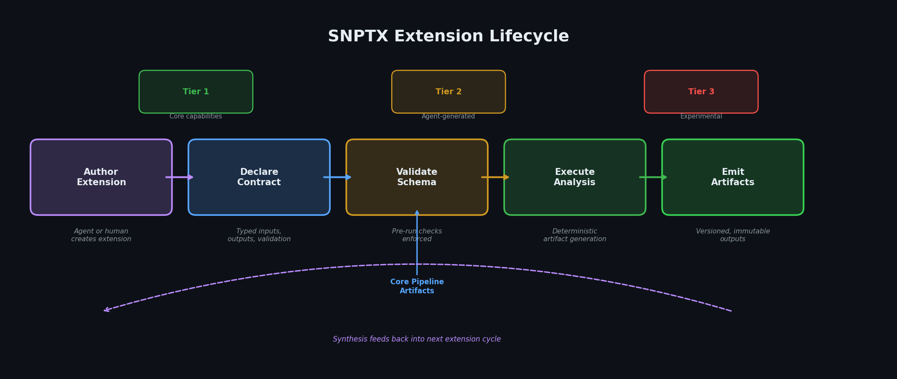

# SNPTX Extension Development Model

## Overview

SNPTX separates core pipeline execution from downstream analysis through a structured extension system. Extensions consume artifacts produced by the core pipeline, generate new outputs, and never modify upstream state. This boundary guarantees that interpretation does not alter the data it interprets.

Extensions are the mechanism by which SNPTX transforms raw experimental outputs into actionable intelligence: calibration diagnostics, evaluation summaries, metric aggregation, and cross-run synthesis.

---

## Extension Architecture

### Core vs. Extension Boundary

| Component | Core Pipeline | Extension |
|---|---|---|
| Purpose | Train, evaluate, produce artifacts | Analyze, synthesize, report |
| Artifact access | Read/write | Read-only |
| Execution trigger | Snakemake DAG | Post-pipeline invocation |
| Configuration | `configs/config.yaml` | Extension-specific config |
| Output location | `results/`, `metrics/`, `models/` | `results/extensions/{extension_name}/` |

Extensions exist downstream of the core pipeline. They cannot modify training artifacts, evaluation metrics, or model files. They can only consume these artifacts and produce new outputs.

### Contract Structure

Each extension declares a contract specifying:

1. **Required inputs.** Which artifacts the extension expects (metrics files, model artifacts, evaluation outputs).
2. **Output specification.** What the extension produces and where it writes results.
3. **Validation rules.** Conditions that must hold for the extension to execute (e.g., required files exist, schema constraints are met).

Contract definitions live in `extensions/{extension_name}/contract.yaml` and are validated before execution.

---

## Current Extensions

### Tier 1 (Operational)

| Extension | Purpose | Inputs | Outputs |
|---|---|---|---|
| `calibration_diagnostics` | Assess model calibration quality | Evaluation metrics, predictions | Calibration curves, reliability diagrams |
| `evaluation_summary_report` | Generate standardized model evaluation reports | Metrics JSON, model metadata | HTML/Markdown reports |
| `metric_aggregation` | Aggregate metrics across runs and configurations | Per-run metric files | Summary statistics, comparison tables |

### Planned Extensions

| Extension | Purpose | Phase |
|---|---|---|
| `cross_run_synthesis` | Compare and synthesize results across experimental runs | Phase 3 |
| `embedding_analysis` | Analyze learned representations from deep learning models | Phase 4 |
| `model_comparison_dashboard` | Interactive comparison of model architectures and performance | Phase 4 |
| `hypothesis_generator` | Suggest next experiments based on evaluation history | Phase 5 |

---

## Writing a New Extension

### Directory Structure

```
extensions/
  your_extension/
    contract.yaml
    run.py
    README.md
    tests/
      test_contract.py
```

### Contract Template

```yaml
name: your_extension
version: "0.1.0"
tier: 1

inputs:
  required:
    - path: "metrics/"
      description: "Per-run evaluation metrics"
    - path: "results/verified/"
      description: "Verified pipeline outputs"

outputs:
  directory: "results/extensions/your_extension/"
  files:
    - name: "output.json"
      description: "Primary analysis output"

validation:
  pre_run:
    - check: "files_exist"
      paths: ["metrics/summary.csv"]
```

### Development Guidelines

1. **Read-only artifact access.** Extensions must not write to any directory outside their designated output location.
2. **Deterministic output.** Given the same inputs, an extension must produce identical outputs. Use fixed seeds where randomness is involved.
3. **Schema compliance.** Contract declarations must match actual behavior. Pre-run validation checks are enforced.
4. **Self-contained dependencies.** Extensions should declare their own requirements and not assume packages beyond the base SNPTX environment.
5. **Test coverage.** Include contract validation tests that verify input requirements and output schema.

---

## Agentic Workflow Execution



SNPTX extensions are designed to be authored and executed by agentic workflows: AI agents that autonomously generate analysis modules, validate contracts, run evaluations, and synthesize results.

### Why Extensions Are Agent-Ready

| Property | Agentic Benefit |
|---|---|
| Typed contracts | Agents validate extension schemas before execution |
| Deterministic outputs | Agent-generated results are reproducible and auditable |
| Artifact-only interfaces | Agents operate through file I/O, not API coupling |
| Self-contained structure | Each extension is an independent, testable unit |
| Configuration-driven behavior | Agents modify behavior through YAML, not code changes |

### Agentic Extension Lifecycle

1. **Generation.** An agent authors the extension directory structure, contract YAML, and execution script.
2. **Validation.** The agent runs contract validation to verify input/output declarations match implementation.
3. **Execution.** The agent invokes the extension against core pipeline artifacts.
4. **Synthesis.** The agent consumes extension outputs for cross-run comparison or hypothesis generation.
5. **Iteration.** Feedback from synthesis informs the next extension or configuration change.

This lifecycle enables fully automated analytical workflows where agents build, execute, and iterate on extensions without manual intervention, while maintaining full reproducibility and auditability through the artifact-driven interface.

---

## Extension Execution

Extensions are invoked after the core pipeline completes:

```bash
# Run a specific extension
python -m extensions.calibration_diagnostics.run

# Run all tier-1 extensions
snakemake --snakefile Snakefile -R run_extensions
```

Extension outputs are written to `results/extensions/{extension_name}/` and are versioned alongside core artifacts.

---

## Extension Tiers

| Tier | Description | Review Level |
|---|---|---|
| Tier 1 | Core analysis capabilities shipped with SNPTX | Maintained by core team |
| Tier 2 | Agent-generated or externally authored extensions with validated contracts | Contract review required |
| Tier 3 | Experimental extensions for research exploration | Self-serve, no guarantees |

Tier progression requires contract validation, test coverage, and documentation completeness.

---

## Deep Learning Extension Opportunities

The extension system is designed to support analysis of deep learning model outputs:

| Analysis Type | Extension Capability |
|---|---|
| Embedding visualization | Dimensionality reduction of learned representations, cluster analysis |
| Attention analysis | Transformer attention weight visualization and interpretation |
| Feature importance | Gradient-based attribution for deep learning predictions |
| Calibration under distribution shift | Out-of-distribution detection and calibration assessment |
| Cross-architecture comparison | Standardized evaluation across model families (CNN, transformer, GNN) |

These capabilities become available as the core pipeline integrates deep learning model types in Phases 4 and 5 of the roadmap.

---

## Extension Submission

Extension submission guidelines, contract review processes, and integration workflows are documented in the extensions repository. See the SNPTX Extensions project for details.

---

## Documentation

For detailed technical architecture, see [ARCHITECTURE.md](ARCHITECTURE.md).  
For the development roadmap, see [ROADMAP.md](ROADMAP.md).  
For the extension development model, see [DEVKIT_NOTES.md](DEVKIT_NOTES.md).  
For strategic positioning, see [POSITIONING.md](POSITIONING.md).  
For market analysis and TAM, see [MARKET_ANALYSIS.md](MARKET_ANALYSIS.md).  

---

## Repository Structure

```
snptx-public/
+-- README.md
+-- docs/
    +-- ARCHITECTURE.md
    +-- ROADMAP.md
    +-- DEVKIT_NOTES.md
    +-- VISION.md
    +-- POSITIONING.md
    +-- INVESTOR_BRIEF.md
    +-- MARKET_ANALYSIS.md
    +-- assets/
        +-- agentic_workflow.png
        +-- discovery_loop.png
        +-- extension_lifecycle.png
        +-- market_growth.png
        +-- multimodal_framework.png
        +-- positioning_matrix.png
        +-- self_learning_trajectory.png
        +-- snptx_architecture.png
        +-- SNPTX_Project_roadmap.png
        +-- tam_sam_som.png
        +-- workflow_dag.png
```

This repository contains documentation and architectural specifications only. Source code, datasets, model artifacts, and execution scripts are maintained in private repositories.

---

**SNPTX**  
Connecting Data to Discovery

Dan Russell, Founder  
MITx (SDS), Harvard ALM (DS) '27

drr508@g.harvard.edu | dan@snptx.ai
