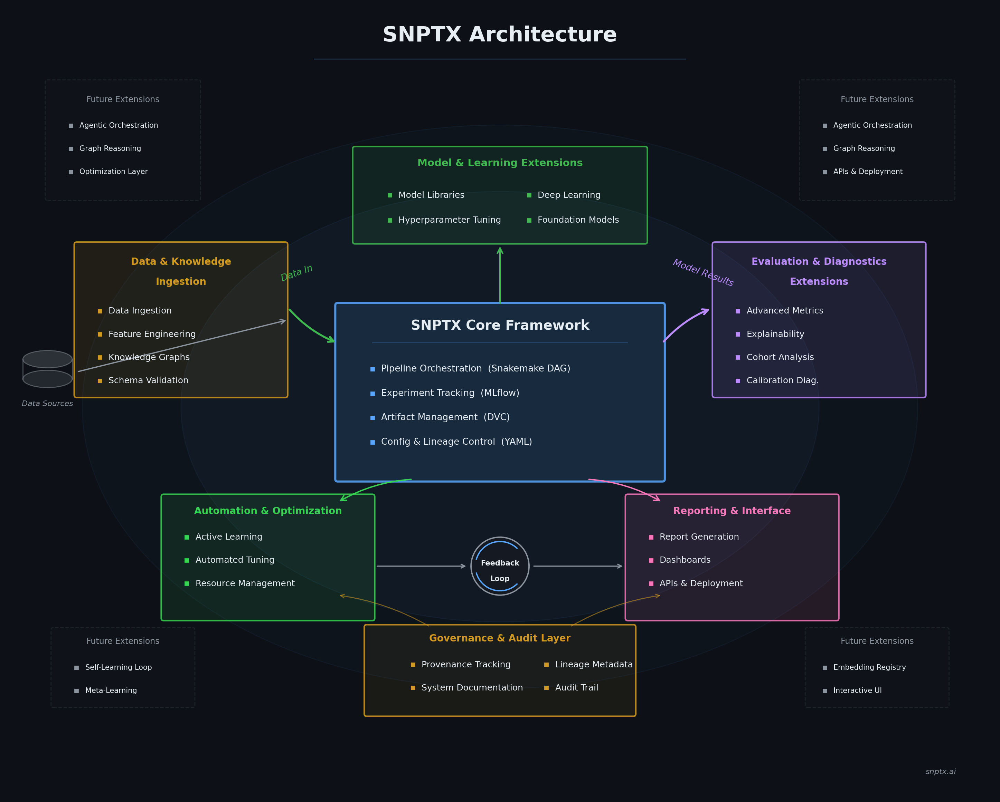

# SNPTX — Investor Brief

---

## Problem

Biomedical machine learning is producing results that do not reproduce. The failure is not algorithmic — it is infrastructural. Research pipelines lack deterministic execution guarantees, artifact governance, and structured provenance. When multiple teams collaborate on analytical workflows, there is no architectural mechanism to prevent silent drift in methodology, data versioning, or interpretation logic.

This problem is acute in three contexts:

1. **Regulatory-adjacent ML** — FDA and EMA increasingly expect auditable, reproducible computational evidence. Existing tools log metrics but do not enforce the structural conditions for reproducibility.
2. **Multi-site research** — Consortium studies require that independent collaborators contribute analysis without introducing uncontrolled variation. Current practice relies on social coordination, not architectural enforcement.
3. **Commercial biotech R&D** — Pipeline integrity directly affects drug development timelines. A single unreproducible result can invalidate months of downstream analysis.

The market lacks a framework that treats reproducibility and governance as architectural constraints rather than documentation aspirations.

---

## Solution

SNPTX is a deterministic orchestration framework for reproducible biomedical machine learning. It provides:

- **Pipeline orchestration** via Snakemake, defining reproducible DAGs from data ingestion through model evaluation and reporting.
- **Experiment tracking** via MLflow, logging parameters, metrics, artifacts, and model versions for every run.
- **Artifact versioning** via DVC, managing datasets, models, and derived outputs across local and remote storage.
- **Extension governance** via a contract-driven, owner-mediated execution model that separates analytical interpretation from pipeline control.

The core framework is intentionally narrow: it controls what runs and when. Downstream analysis — diagnostics, metric normalization, reporting — is handled by governed extensions that consume artifacts through declared, validated contracts.

---

## Architecture Moat

SNPTX's competitive differentiation is architectural, not feature-based:

**1. Execution–Interpretation Boundary**
The separation between the core pipeline (what runs) and the extension layer (how results are interpreted) is not a convention — it is enforced through physical repository isolation, contract validation, and owner-mediated invocation. No competitor in the MLOps landscape implements this boundary.

**2. Contract-Driven Extension System**
Every extension declares typed input/output contracts that are validated at runtime. The owner-runner generates deterministic run IDs, captures logs, and produces auditable manifests. This creates a governed collaboration surface that scales without sacrificing control.

**3. Deterministic Execution Guarantees**
Fixed seeds, versioned configuration, DAG-based orchestration, and artifact immutability create structural conditions for reproducibility. The system is designed so that identical inputs produce identical outputs — not as a best practice, but as an architectural invariant.

**4. Infrastructure Agnosticism**
SNPTX is agnostic to model type, data modality, and learning methodology. It provides governance and orchestration within which any compliant analytical module can operate. This positions the framework as infrastructure, not tooling.

---

## Early Traction

| Milestone | Status |
|---|---|
| Deterministic orchestration core (Snakemake + MLflow + DVC) | Operational |
| End-to-end reproducible training pipeline | Operational |
| Governed extension ecosystem with contract validation | Operational |
| Three reference Tier-1 extensions (diagnostics, aggregation, reporting) | Complete |
| Artifact semantics contract (frozen for Tier 1) | Published |
| CI validation pipeline (GitHub Actions) | Operational |

The framework has been developed and validated on clinical readmission prediction workflows using synthetic EHR data. The architecture is designed for multi-modality expansion (omics, imaging, knowledge graphs) through configuration, not code modification.

---

## Roadmap

| Horizon | Focus | Timeline |
|---|---|---|
| **Near-term** | Schema convergence, contract validation, intelligent summarization | Next |
| **Medium-term** | Dashboard and API layer, cohort analysis, enterprise packaging | 6–12 months |
| **Long-term** | Multi-modality expansion, closed-loop feedback, institutional deployment | 12–24 months |

The architecture is designed so that each horizon builds on stable interfaces. Future capabilities are extensions, not refactors.

---

## Funding Direction

SNPTX is positioned for pre-seed or seed investment to accelerate:

1. **Core infrastructure hardening** — schema convergence, determinism verification, CI/CD execution (not just dry-run)
2. **Extension ecosystem expansion** — cohort analysis, explainability, intelligent summarization
3. **Market validation** — pilot deployments with 2–3 research labs or biotech R&D teams
4. **Team expansion** — infrastructure engineering, biomedical domain expertise, go-to-market

The capital-efficient development model (single-developer architecture, cloud-native infrastructure, no model training costs) enables meaningful progress at pre-seed scale.

---

## Team

- **Dan Rogers** — Harvard, systems architecture, biomedical ML infrastructure

---

## Contact

- drr508@g.harvard.edu
- dan@snptx.ai
