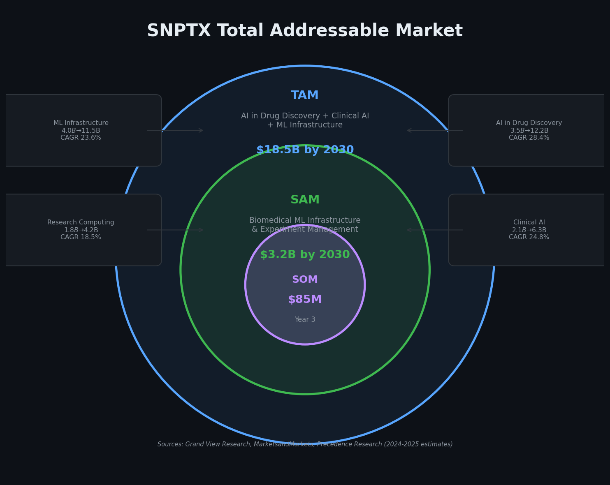
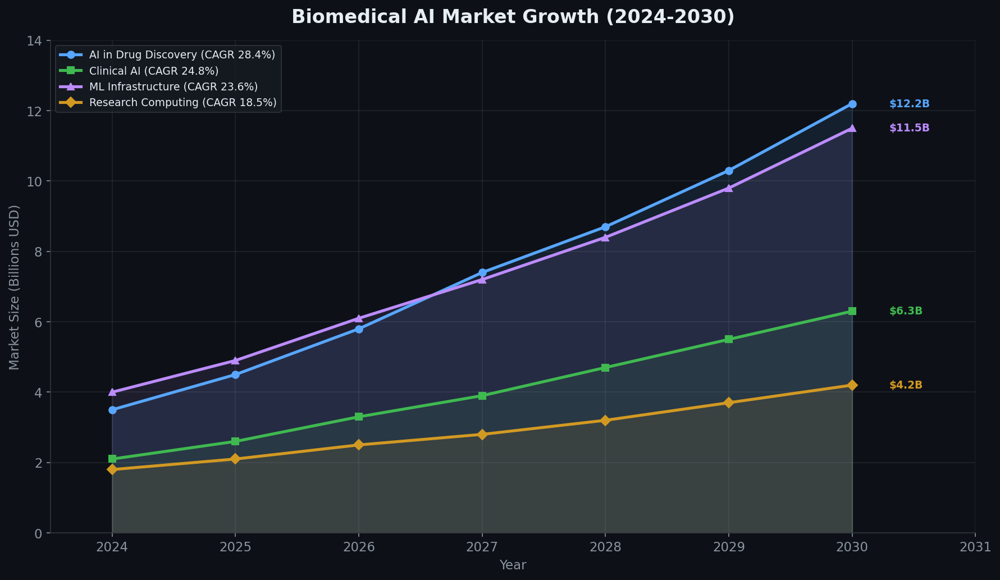

# SNPTX Market Analysis

## Overview

SNPTX operates at the intersection of three converging markets: AI in drug discovery, clinical AI infrastructure, and ML operations tooling for research. Each market is growing independently at 18-28% CAGR, and the intersection where reproducible, agentic ML infrastructure serves biomedical research represents an underserved segment with significant opportunity.

---

## Total Addressable Market (TAM)



### Market Sizing

| Market Segment | 2024 | 2030 (Projected) | CAGR |
|---|---|---|---|
| AI in Drug Discovery | $3.5B | $12.2B | 28.4% |
| Clinical AI | $2.1B | $6.3B | 24.8% |
| ML Infrastructure and Operations | $4.0B | $11.5B | 23.6% |
| Research Computing Infrastructure | $1.8B | $4.2B | 18.5% |
| **Combined TAM** | **$11.4B** | **$34.2B** | **~24%** |

The relevant TAM for SNPTX is the subset of these markets where infrastructure determines research velocity: $18.5B by 2030, comprising organizations that need reproducible ML pipelines for biomedical applications.

### Serviceable Addressable Market (SAM): $3.2B by 2030

SNPTX's SAM comprises organizations that specifically need:

- Deterministic ML pipeline orchestration for biomedical data
- Experiment tracking with full artifact provenance
- Structured evaluation frameworks for model comparison
- Agentic workflow support for automated experimentation

This includes mid-size biotech computational teams, academic research labs with ML infrastructure needs, pharmaceutical R&D innovation groups, and clinical AI development organizations.

### Serviceable Obtainable Market (SOM): $85M by Year 3

Initial market capture through mid-size biotech pilots, academic partnerships, and early enterprise contracts. Based on:

- 15-25 mid-size biotech customers at $50K-200K annual contract value
- 5-10 academic institutional licenses at $25K-75K
- 2-5 pharma R&D partnership contracts at $200K-500K

---

## Market Growth Drivers



### 1. Reproducibility Crisis in Biomedical AI

An estimated 70% of computational biology results fail to reproduce across labs. Regulatory agencies (FDA, EMA) are increasingly requiring computational provenance for AI-derived insights in drug submissions. SNPTX addresses this directly through deterministic execution, artifact versioning, and full pipeline traceability.

### 2. Deep Learning Adoption in Drug Discovery

The pharmaceutical industry is rapidly adopting transformer models, graph neural networks, and foundation models for target identification, molecular property prediction, and clinical outcome modeling. These models require infrastructure that supports complex training pipelines, hyperparameter management, and systematic model comparison. SNPTX provides this infrastructure layer.

### 3. Agentic AI in Research Workflows

The emerging category of agentic AI workflows, where autonomous agents execute experimental pipelines, generate analyses, and propose hypotheses, requires infrastructure that is deterministic, contract-driven, and auditable. SNPTX is architecturally designed for agentic execution, a differentiator that positions it ahead of incumbent MLOps tools.

### 4. Multi-Modal Data Integration

Biomedical research increasingly combines clinical records, genomic data, imaging, and molecular graphs. Infrastructure that supports multi-modal pipelines through configuration rather than custom engineering reduces time-to-insight and enables cross-modality comparison.

### 5. Consortium and Multi-Site Research

Large-scale research consortia (TCGA, UK Biobank, All of Us) require standardized computational infrastructure that ensures reproducibility across institutions. SNPTX's artifact-driven architecture and extension system provide the standardization layer these projects need.

---

## Competitive Landscape

### Direct Competitors

| Company / Tool | Category | Funding | Weakness Relative to SNPTX |
|---|---|---|---|
| Weights & Biases | Experiment tracking | $250M+ | No orchestration, no extension system |
| MLflow (Databricks) | Experiment tracking + registry | Public company | No DAG orchestration, no structured extensions |
| DVC (Iterative) | Data/model versioning | $20M+ | Limited orchestration, no evaluation framework |
| Kubeflow (Google) | Pipeline orchestration | Open source | Kubernetes dependency, no extension system, no biomedical focus |
| Metaflow (Netflix/Outerbounds) | Pipeline orchestration | $21M | No artifact versioning, no extension system |
| Nextflow (Seqera) | Bioinformatics pipelines | $26M | Bioinformatics-focused, no ML experiment tracking |
| Flyte (Union.ai) | Pipeline orchestration | $30M+ | No biomedical focus, no extension system |

### SNPTX Differentiation

No competitor combines all five of SNPTX's core capabilities:

1. **Deterministic DAG orchestration** (Snakemake)
2. **Full experiment tracking** (MLflow)
3. **Artifact versioning with provenance** (DVC)
4. **Contract-driven extension system** (unique to SNPTX)
5. **Agentic workflow architecture** (unique to SNPTX)

### Incumbent Limitations

Existing tools solve individual concerns in isolation:

- **Tracking tools** (W&B, MLflow) record what happened but do not control what is allowed to happen.
- **Versioning tools** (DVC) track data lineage but do not orchestrate computation or evaluation.
- **Orchestration tools** (Kubeflow, Metaflow) manage execution but provide no structured evaluation or extension surface.

SNPTX integrates all three domains and adds the extension system and agentic execution layer that none of these tools provide.

---

## Market Timing

### Why Now

1. **Regulatory pressure.** FDA is formalizing expectations for AI/ML in drug development (2024 guidance documents). Reproducibility infrastructure becomes a compliance requirement, not a best practice.

2. **Foundation model adoption.** The shift from classical ML to foundation models in biomedicine creates a new infrastructure need that incumbent tools were not designed for.

3. **Agentic AI emergence.** The category of agentic AI workflows is nascent. Infrastructure designed for agentic execution has first-mover advantage in defining how biomedical AI agents operate.

4. **Open-source consolidation.** The MLOps tool landscape is fragmenting. Organizations are seeking integrated solutions that reduce tool sprawl. SNPTX's integrated stack addresses this directly.

---

## Sources

Market sizing estimates are derived from:

- Grand View Research: AI in Drug Discovery Market (2024)
- MarketsandMarkets: Clinical AI Market (2024)
- Precedence Research: ML Infrastructure Market (2025)
- Allied Market Research: Research Computing Market (2024)
- Gartner: MLOps and AI Engineering Forecast (2024)

All projections are interpolated from published CAGR estimates and represent market opportunity ranges, not guaranteed outcomes.

---

## Documentation

For detailed technical architecture, see [ARCHITECTURE.md](ARCHITECTURE.md).  
For the development roadmap, see [ROADMAP.md](ROADMAP.md).  
For the extension development model, see [DEVKIT_NOTES.md](DEVKIT_NOTES.md).  
For strategic positioning, see [POSITIONING.md](POSITIONING.md).  

---

## Repository Structure

```
snptx-public/
+-- README.md
+-- docs/
    +-- ARCHITECTURE.md
    +-- ROADMAP.md
    +-- DEVKIT_NOTES.md
    +-- VISION.md
    +-- POSITIONING.md
    +-- INVESTOR_BRIEF.md
    +-- MARKET_ANALYSIS.md
    +-- assets/
        +-- agentic_workflow.png
        +-- discovery_loop.png
        +-- extension_lifecycle.png
        +-- market_growth.png
        +-- multimodal_framework.png
        +-- positioning_matrix.png
        +-- self_learning_trajectory.png
        +-- snptx_architecture.png
        +-- SNPTX_Project_roadmap.png
        +-- tam_sam_som.png
        +-- workflow_dag.png
```

This repository contains documentation and architectural specifications only. Source code, datasets, model artifacts, and execution scripts are maintained in private repositories.

---

**SNPTX**  
Connecting Data to Discovery

Dan Russell, Founder  
MITx (SDS), Harvard ALM (DS) '27

drr508@g.harvard.edu | dan@snptx.ai
