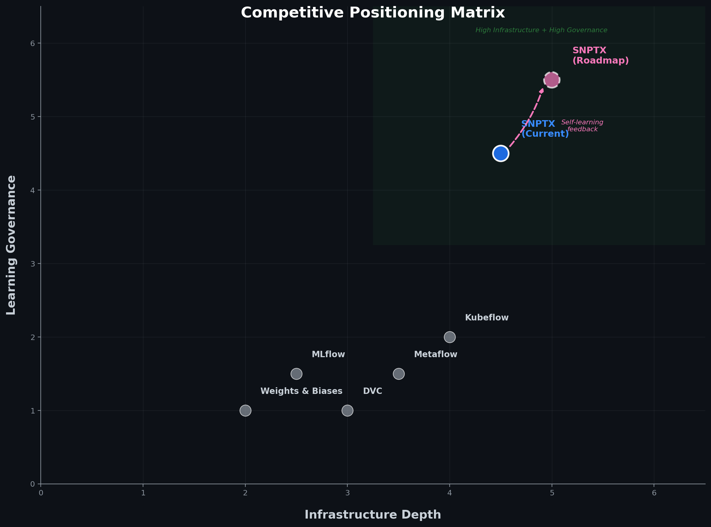

# SNPTX Technical Positioning

## Why SNPTX Is Not Just MLOps

MLOps tooling solves deployment efficiency: moving models from notebooks to production. SNPTX solves a different problem: enabling reproducible deep learning experimentation, multi-modal model comparison, and structured hypothesis generation within infrastructure that guarantees determinism and full provenance.

The distinction is architectural, not cosmetic.

---

## SNPTX vs. MLflow-Only Workflows

MLflow provides experiment tracking, model registration, and artifact logging. SNPTX uses MLflow for these purposes and adds:

| Capability | MLflow | SNPTX |
|---|---|---|
| DAG-based pipeline orchestration | No | Yes (Snakemake) |
| Deterministic execution guarantees | No | Yes (fixed seeds, versioned config) |
| Artifact immutability as architectural constraint | No | Yes |
| Structured extension system for downstream analysis | No | Yes (contract-driven) |
| Separation of execution from interpretation | No | Yes (core vs. extension boundary) |
| Cross-run synthesis and hypothesis generation | No | Planned |

An MLflow-only workflow tracks what happened. SNPTX controls what is allowed to happen and provides the infrastructure for learning from evaluation histories.

---

## SNPTX vs. DVC-Based Workflows

DVC provides dataset and model versioning with remote storage. SNPTX uses DVC for artifact persistence and adds:

| Capability | DVC | SNPTX |
|---|---|---|
| Multi-rule DAG orchestration with parameterized sweeps | Limited | Yes (Snakemake) |
| Experiment tracking with metric history | Separate tool | Yes (MLflow integration) |
| Structured downstream analysis extensions | No | Yes |
| Embedding registry with provenance | No | Planned |
| Self-learning feedback from evaluation artifacts | No | Planned |

A DVC-based workflow versions data. SNPTX versions data, orchestrates computation, tracks experiments, enables downstream analysis, and is designed to support closed-loop experimentation.

---

## Why Infrastructure Depth Matters for Biomedical AI

The reproducibility crisis in biomedical ML is not caused by model quality. It is caused by:

1. **Uncontrolled analytical drift.** Downstream analysis modifies interpretation without versioned inputs.
2. **Implicit state dependencies.** Pipelines rely on undeclared files, environment variables, or runtime ordering.
3. **No structured model comparison.** Teams compare results informally rather than through standardized evaluation artifacts.
4. **Missing provenance.** Results cannot be traced to specific inputs, configurations, and code versions.

SNPTX addresses each root cause:

| Root Cause | SNPTX Response |
|---|---|
| Analytical drift | Extensions are downstream, artifact-only, and immutable |
| Implicit state | Configuration is explicit; DAG ordering is deterministic |
| Unstructured comparison | MLflow tracking + evaluation extensions enable systematic model comparison |
| Missing provenance | Artifact versioning, input hashing, commit embedding, experiment logging |

---

## Competitive Positioning

| System | Orchestration | Tracking | Versioning | Structured Extensions | Self-Learning Trajectory |
|---|---|---|---|---|---|
| MLflow | No | Yes | Partial | No | No |
| DVC | Partial | Partial | Yes | No | No |
| Kubeflow | Yes | Yes | Partial | No | No |
| Metaflow | Yes | Yes | No | No | No |
| Weights and Biases | No | Yes | No | No | No |
| **SNPTX** | **Yes** | **Yes** | **Yes** | **Yes** | **Planned** |

SNPTX occupies a unique position: deep infrastructure depth combined with structured downstream analysis and a designed trajectory toward self-learning feedback. No competitor in this landscape combines orchestration, tracking, versioning, extension-based analysis, and a self-learning architecture.

---

## Who This Is For

- **Research labs** running reproducible deep learning experiments across collaborators
- **Pharma and biotech R&D teams** comparing model architectures for drug discovery pipelines
- **Clinical AI developers** building tools that require full pipeline provenance
- **Consortium projects** where multiple institutions contribute analysis across modalities
- **Technical founders** building ML infrastructure for biomedical applications

---

## Contact

- drr508@g.harvard.edu
- dan@snptx.ai
