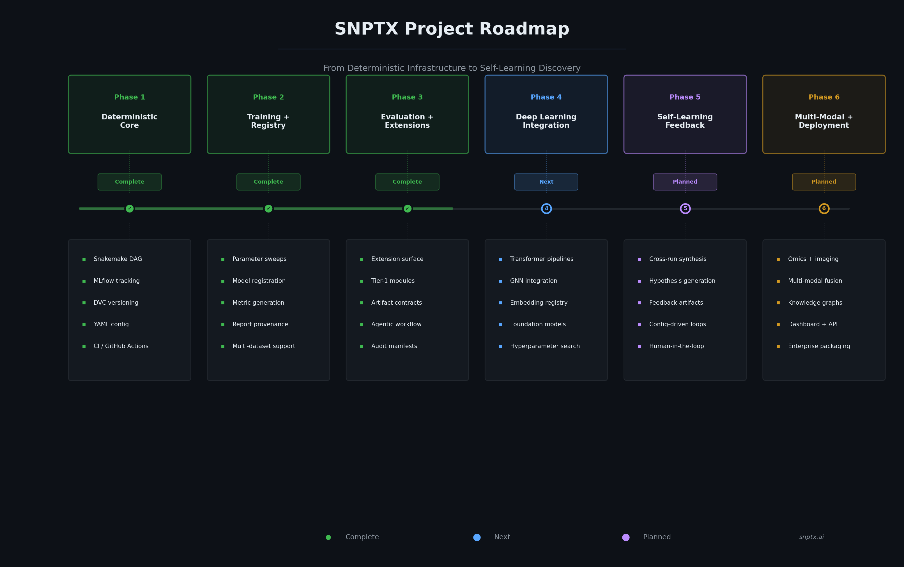

# SNPTX Roadmap

This document defines the phased development plan for SNPTX, aligning technical milestones with the trajectory from deterministic infrastructure through deep learning integration to self-learning discovery acceleration.

Completed phases reflect operational capabilities. Planned phases reflect committed architectural targets with defined technical prerequisites.

---

## Guiding Objectives

1. Build a reproducible, deterministic data-to-discovery ML framework for biomedical applications.
2. Enable deep learning experimentation within infrastructure that guarantees reproducibility.
3. Support multi-modal model integration through configuration, not code coupling.
4. Implement structured self-learning feedback from evaluation outputs to pipeline configuration.
5. Progress toward intelligent, interactive layers only after core interfaces stabilize.

---

## Roadmap Overview



| Phase | Focus | Status |
|---|---|---|
| **Phase 1** | Deterministic Core | Complete |
| **Phase 2** | Training + Registry | Complete |
| **Phase 3** | Evaluation + Extension Surface | Complete |
| **Phase 4** | Deep Learning Integration | Planned |
| **Phase 5** | Self-Learning Feedback | Planned |
| **Phase 6** | Multi-Modal Expansion + Deployment | Planned |

---

## Phase 1: Deterministic Core (Complete)

**Objective:** Establish a stable, reproducible execution foundation.

- [x] Cloud infrastructure setup with persistent environment
- [x] Repository scaffolding and Python environment isolation
- [x] Snakemake DAG for training, evaluation, and reporting
- [x] MLflow experiment tracking and model registry integration
- [x] DVC dataset and model versioning with remote storage
- [x] YAML-based configuration for datasets, features, and parameters
- [x] CI validation via GitHub Actions
- [x] Deterministic train/test splitting with fixed seeds

**Outcome:** Reproducible orchestration core where identical inputs produce identical outputs. Pipeline execution is fully defined by configuration and DAG structure.

---

## Phase 2: Training + Registry (Complete)

**Objective:** End-to-end reproducible pipeline from raw data to registered models.

- [x] Parameter sweeps via Snakemake wildcards
- [x] Automatic model evaluation and metric comparison
- [x] Confusion matrix and structured metric generation
- [x] Model registration in MLflow with version tracking
- [x] Report generation with commit provenance
- [x] Multi-dataset ingestion support via configuration
- [x] Fully materialized `results/` outputs

**Outcome:** Complete data-to-report pipeline. Every training run produces versioned models, structured metrics, and traceable reports.

---

## Phase 3: Evaluation + Extension Surface (Complete)

**Objective:** Establish an extension surface for downstream analysis and agentic workflow integration.

- [x] Separate `snptx-extensions` repository established
- [x] Tier-1 extension specification format defined
- [x] Agentic execution boundary with contract validation
- [x] Artifact-only, downstream execution model implemented
- [x] Shared artifact semantics documented
- [x] Reference Tier-1 modules implemented:
  - [x] `calibration_diagnostics`
  - [x] `metric_aggregation`
  - [x] `evaluation_summary_report`
- [x] Deterministic outputs with auditable manifests

**Outcome:** Agentic-workflow-ready extension surface. Automated agents and orchestrated workflows build analytical modules without touching training pipelines or core execution logic.

### Agentic Workflow Architecture

Phase 3 establishes the architectural foundation for agentic execution:

- **Contract-driven interfaces** enable agents to generate, validate, and execute extensions autonomously
- **Deterministic execution guarantees** ensure agent-produced results are reproducible across invocations
- **Configuration-as-code** allows agents to modify pipeline behavior through YAML without source code changes
- **Artifact immutability** provides full auditability of agent-generated outputs
- **Typed input/output schemas** give agents structured boundaries for extension development

---

## Phase 4: Deep Learning Integration (Planned)

**Objective:** Extend the deterministic infrastructure to support advanced model architectures.

**Next Technical Horizon**

- [ ] Transformer training pipelines for EHR sequence modeling and clinical NLP
- [ ] Graph neural network integration for molecular and knowledge graph reasoning
- [ ] Representation learning pipelines with embedding output as versioned artifacts
- [ ] Foundation model fine-tuning within deterministic checkpoint management
- [ ] Hyperparameter search integration with structured comparison
- [ ] Embedding registry: versioned representation storage with full provenance
- [ ] Multi-model comparison extensions for systematic architecture evaluation

**Design Principle:** Deep learning pipelines operate within the same Snakemake + MLflow + DVC infrastructure. No special-case orchestration. Model complexity scales; infrastructure guarantees remain constant.

**Outcome:** Researchers can train, compare, and iterate on deep learning models with the same reproducibility guarantees that apply to classical ML pipelines.

---

## Phase 5: Self-Learning Feedback (Planned)

**Objective:** Enable structured feedback from evaluation outputs to pipeline configuration.

**Discovery Acceleration Target**

- [ ] Cross-run synthesis extension: pattern identification across evaluation histories
- [ ] Structured hypothesis generation from accumulated evidence
- [ ] Feedback artifact specification (`feedback.json` contract)
- [ ] Config-driven feedback loops: evaluation insights flow back into pipeline parameters
- [ ] Closed-loop demonstration: evaluation, synthesis, hypothesis, configuration adjustment
- [ ] Human-in-the-loop review for feedback validation

**Design Constraints:**
- Feedback operates through the artifact-driven interface
- No automatic retraining without explicit authorization
- Determinism guarantees are preserved through the feedback path
- Feedback signals are advisory and traceable

**Outcome:** The system learns from its own evaluation outputs. Researchers receive structured hypotheses that accelerate experimental iteration without sacrificing reproducibility.

---

## Phase 6: Multi-Modal Expansion + Deployment (Planned)

**Objective:** Demonstrate framework generality across biomedical data modalities and deploy interfaces.

**Commercialization Horizon**

- [ ] Clinical classification, survival analysis, and cohort stratification
- [ ] Omics data integration: embeddings, biomarker discovery, pathway analysis
- [ ] Imaging pipeline support: histopathology, radiology feature extraction
- [ ] Knowledge graph and molecular graph workflows
- [ ] Multi-modal fusion: cross-modality training and evaluation
- [ ] Contrastive learning for patient similarity and cohort discovery
- [ ] Dashboard and API layer backed by deterministic artifacts
- [ ] Enterprise packaging and multi-team deployment support

**Outcome:** SNPTX operates across data modalities through configuration. Each modality emits standardized artifacts for cross-modal comparability. User-facing interfaces expose results without compromising execution guarantees.

---

## Milestone Summary

| Milestone | Phase | Status |
|---|---|---|
| Reproducible orchestration core | 1 | Complete |
| End-to-end training pipeline | 2 | Complete |
| Extension ecosystem | 3 | Complete |
| Deep learning pipeline support | 4 | Next |
| Embedding registry | 4 | Planned |
| Self-learning feedback | 5 | Planned |
| Multi-modal expansion | 6 | Planned |
| API and dashboard layer | 6 | Planned |

---

## Ongoing Practices

- Architecture, README, and roadmap are kept synchronized
- Artifact schemas are treated as stable contracts
- New capabilities are added as extensions, not core modifications
- Milestones are tagged in Git for historical reference

---

## Documentation

For detailed technical architecture, see [ARCHITECTURE.md](ARCHITECTURE.md).  
For the development roadmap, see [ROADMAP.md](ROADMAP.md).  
For the extension development model, see [DEVKIT_NOTES.md](DEVKIT_NOTES.md).  
For strategic positioning, see [POSITIONING.md](POSITIONING.md).  
For market analysis and TAM, see [MARKET_ANALYSIS.md](MARKET_ANALYSIS.md).  

---

## Repository Structure

```
snptx-public/
+-- README.md
+-- docs/
    +-- ARCHITECTURE.md
    +-- ROADMAP.md
    +-- DEVKIT_NOTES.md
    +-- VISION.md
    +-- POSITIONING.md
    +-- INVESTOR_BRIEF.md
    +-- MARKET_ANALYSIS.md
    +-- assets/
        +-- agentic_workflow.png
        +-- discovery_loop.png
        +-- extension_lifecycle.png
        +-- market_growth.png
        +-- multimodal_framework.png
        +-- positioning_matrix.png
        +-- self_learning_trajectory.png
        +-- snptx_architecture.png
        +-- SNPTX_Project_roadmap.png
        +-- tam_sam_som.png
        +-- workflow_dag.png
```

This repository contains documentation and architectural specifications only. Source code, datasets, model artifacts, and execution scripts are maintained in private repositories.

---

**SNPTX**  
Connecting Data to Discovery

Dan Russell, Founder  
MITx (SDS), Harvard ALM (DS) '27

drr508@g.harvard.edu | dan@snptx.ai
