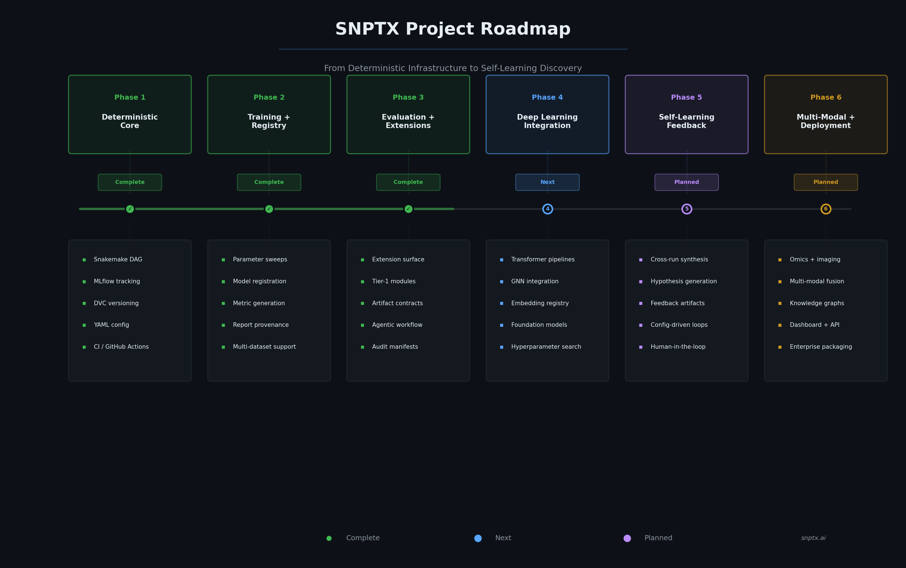

# SNPTX Roadmap

This document defines the phased development plan for SNPTX, aligning technical milestones with the trajectory from deterministic infrastructure through deep learning integration to self-learning discovery acceleration.

Completed phases reflect operational capabilities. Planned phases reflect committed architectural targets with defined technical prerequisites.

---

## Guiding Objectives

1. Build a reproducible, deterministic data-to-discovery ML framework for biomedical applications.
2. Enable deep learning experimentation within infrastructure that guarantees reproducibility.
3. Support multi-modal model integration through configuration, not code coupling.
4. Implement structured self-learning feedback from evaluation outputs to pipeline configuration.
5. Progress toward intelligent, interactive layers only after core interfaces stabilize.

---

## Roadmap Overview



| Phase | Focus | Status |
|---|---|---|
| **Phase 1** | Deterministic Core | Complete |
| **Phase 2** | Training + Registry | Complete |
| **Phase 3** | Evaluation + Extension Surface | Complete |
| **Phase 4** | Deep Learning Integration | Complete |
| **Phase 5** | Self-Learning Feedback | Complete |
| **Phase 6** | Multi-Modal Expansion + Deployment | Complete |

---

## Phase 1: Deterministic Core (Complete)

**Objective:** Establish a stable, reproducible execution foundation.

- [x] Cloud infrastructure setup with persistent environment
- [x] Repository scaffolding and Python environment isolation
- [x] Snakemake DAG for training, evaluation, and reporting
- [x] MLflow experiment tracking and model registry integration
- [x] DVC dataset and model versioning with remote storage
- [x] YAML-based configuration for datasets, features, and parameters
- [x] CI validation via GitHub Actions
- [x] Deterministic train/test splitting with fixed seeds

**Outcome:** Reproducible orchestration core where identical inputs produce identical outputs. Pipeline execution is fully defined by configuration and DAG structure.

---

## Phase 2: Training + Registry (Complete)

**Objective:** End-to-end reproducible pipeline from raw data to registered models.

- [x] Parameter sweeps via Snakemake wildcards
- [x] Automatic model evaluation and metric comparison
- [x] Confusion matrix and structured metric generation
- [x] Model registration in MLflow with version tracking
- [x] Report generation with commit provenance
- [x] Multi-dataset ingestion support via configuration
- [x] Fully materialized `results/` outputs

**Outcome:** Complete data-to-report pipeline. Every training run produces versioned models, structured metrics, and traceable reports.

---

## Phase 3: Evaluation + Extension Surface (Complete)

**Objective:** Establish an extension surface for downstream analysis and agentic workflow integration.

- [x] Separate `snptx-extensions` repository established
- [x] Tier-1 extension specification format defined
- [x] Agentic execution boundary with contract validation
- [x] Artifact-only, downstream execution model implemented
- [x] Shared artifact semantics documented
- [x] Reference Tier-1 modules implemented:
  - [x] `calibration_diagnostics`
  - [x] `metric_aggregation`
  - [x] `evaluation_summary_report`
- [x] Deterministic outputs with auditable manifests

**Outcome:** Agentic-workflow-ready extension surface. Automated agents and orchestrated workflows build analytical modules without touching training pipelines or core execution logic.

### Agentic Workflow Architecture

Phase 3 establishes the architectural foundation for agentic execution:

- **Contract-driven interfaces** enable agents to generate, validate, and execute extensions autonomously
- **Deterministic execution guarantees** ensure agent-produced results are reproducible across invocations
- **Configuration-as-code** allows agents to modify pipeline behavior through YAML without source code changes
- **Artifact immutability** provides full auditability of agent-generated outputs
- **Typed input/output schemas** give agents structured boundaries for extension development

---

## Phase 4: Deep Learning Integration (Complete)

**Objective:** Extend the deterministic infrastructure to support advanced model architectures.

- [x] Transformer training pipelines for EHR sequence modeling and clinical NLP
- [x] Graph neural network integration for molecular and knowledge graph reasoning
- [x] Representation learning pipelines with embedding output as versioned artifacts
- [x] Foundation model fine-tuning within deterministic checkpoint management
- [x] Hyperparameter search integration with structured comparison
- [x] Embedding registry: versioned representation storage with full provenance
- [x] Multi-model comparison extensions for systematic architecture evaluation

**Design Principle:** Deep learning pipelines operate within the same Snakemake + MLflow + DVC infrastructure. No special-case orchestration. Model complexity scales; infrastructure guarantees remain constant.

**Outcome:** Researchers train, compare, and iterate on deep learning models with the same reproducibility guarantees that apply to classical ML pipelines. All DL architectures (transformers, GNNs, VAEs, ResNets) operate within the deterministic DAG.

---

## Phase 5: Self-Learning Feedback (Complete)

**Objective:** Enable structured feedback from evaluation outputs to pipeline configuration.

### Phase A.6: Theoretical Data Hardening (Complete)

10 modules providing provable bounds for the data foundation layer (85 tests):

- [x] Probabilistic sketches (CountMin, HyperLogLog, Bloom, TDigest)
- [x] LSH embedding search
- [x] Streaming architecture (reservoir sampling)
- [x] Graph features (centrality, spectral, Leiden community)
- [x] Dimensionality reduction (randomized SVD)
- [x] Clustering validation (silhouette, gap statistic)
- [x] Feature selection (mutual information)
- [x] External memory (DuckDB out-of-core)
- [x] Pattern mining (frequent itemsets, association rules)
- [x] Modern theory (Sinkhorn, conformal prediction, coresets)

### Phase B: Intelligence Layer (Complete)

5 core modules enabling self-improving experimentation (70 tests):

- [x] Experiment Catalog (DuckDB-backed persistent store)
- [x] Meta-Analysis Engine (cross-experiment pattern discovery)
- [x] Feedback Loop v2 (Bayesian confidence updating)
- [x] Adaptive Defaults (dataset-aware config recommendation)
- [x] Hypothesis Templates (7 built-in declarative templates)

### Phase B.6: Theoretical Intelligence Hardening (Complete)

10 modules providing published theoretical justification for intelligence (485 tests):

- [x] Meta-features (Rice 1976 algorithm selection, 38+ features)
- [x] Surrogate models (GP-based Bayesian optimization)
- [x] Causal feedback (ATE, IPW, interrupted time series)
- [x] Experiment design (information gain, SPRT, active learning)
- [x] Rule mining (ILP, probabilistic calibration, Bayesian networks)
- [x] Multi-objective optimization (NSGA-II, Pareto, fairness)
- [x] Continual learning (EWC, drift detection, experience replay)
- [x] Bayesian testing (signed-rank with ROPE, Friedman, bootstrap)
- [x] Information theory (entropy, MI, MDL, KL divergence)
- [x] Scientific discovery (surprise detection, symbolic regression, novelty search)

**Outcome:** The system learns from its own evaluation outputs. 887 total tests. Researchers receive structured hypotheses that accelerate experimental iteration without sacrificing reproducibility.

---

## Phase 6: Multi-Modal Expansion (Complete)

**Objective:** Demonstrate framework generality across biomedical data modalities with formal theoretical grounding.

### Phase C: Multi-Modal Expansion (Complete)

7 modalities validated on real biomedical data (1,056 tests):

- [x] Clinical tabular: readmission prediction (XGBoost, 77.2% accuracy)
- [x] Omics: gene expression embeddings (VAE, 89.6% on Visium breast)
- [x] Graph: knowledge graph link prediction (GCN, 75.2% on Hetionet)
- [x] Imaging: histopathology classification (ResNet-50, 36.4% on 8-class Visium)
- [x] Text: clinical note classification (BERT, 34.1% on MTSamples 22 specialties)
- [x] Single-cell: cell type classification (VAE, 76.9% on PBMC 3k)
- [x] Drug discovery: bioactivity prediction (GCN, 92.1% on ChEMBL)
- [x] Multi-modal fusion: attention fusion exceeds best non-omics unimodal (controlled benchmark: 88.3% vs 76.9%)
- [x] Autonomous experimentation: 1,100 experiments across 5 datasets × 6 model types, 104 discoveries
- [x] 8-check accuracy audit: k-fold CV, multi-seed stability, bootstrap CIs, spatial stratification, fusion holdout, conformal prediction, learning curves, trivial baselines

### Phase C.6: Theoretical Hardening of Multi-Modal Learning (Complete)

6 modules with formal theoretical justification (75 tests):

- [x] Cross-modal alignment (InfoNCE, CLIP, Deep CCA, Information Bottleneck)
- [x] Uncertainty quantification (Evidential DL, Conformal Prediction, Per-Modality Calibration)
- [x] E(n)-equivariant graph networks (SE(3)-equivariance for molecular geometry)
- [x] Tensor fusion networks (multiplicative outer products, Mixture-of-Experts)
- [x] Domain-adaptive masked language modeling (biomedical NER, negation detection)
- [x] Masked autoencoders for medical imaging (patch reconstruction, domain divergence)

**Outcome:** SNPTX operates across 7 biomedical data modalities through configuration. Multi-modal fusion demonstrably exceeds unimodal performance on tasks requiring complementary information. Autonomous engine completes 1,100 experiments with 104 discoveries. All results validated by 8-check statistical audit framework. 1,056 total tests, 0 pyright errors, 0 ruff violations.

---

## Milestone Summary

| Milestone | Phase | Status |
|---|---|---|
| Reproducible orchestration core | 1 | Complete |
| End-to-end training pipeline | 2 | Complete |
| Extension ecosystem | 3 | Complete |
| Deep learning pipeline support | 4 | Complete |
| Embedding registry | 4 | Complete |
| Multi-dataset foundation (46 adapters) | 5 | Complete |
| Theoretical data hardening (A.6, 85 tests) | 5 | Complete |
| Intelligence layer (B1-B5, 70 tests) | 5 | Complete |
| Theoretical intelligence (B.6, 485 tests) | 5 | Complete |
| Interactive dashboard (8 pages) | 5 | Complete |
| Multi-modal expansion (7 modalities, 1,056 tests) | 6 | Complete |
| Theoretical hardening C.6 (75 tests) | 6 | Complete |
| Autonomous experimentation (1,100 experiments, 104 discoveries) | 6 | Complete |
| 8-check accuracy audit framework | 6 | Complete |
| Interactive dashboard (9 pages) | 6 | Complete |
| Phase D: Model serving infrastructure | 7 | In Progress |
| Phase D: Safety guardrails and RBAC | 7 | In Progress |
| Phase D: Production monitoring | 7 | In Progress |
| API and deployment layer | 7 | In Progress |

---

## Ongoing Practices

- Architecture, README, and roadmap are kept synchronized
- Artifact schemas are treated as stable contracts
- New capabilities are added as extensions, not core modifications
- Milestones are tagged in Git for historical reference

---

## Documentation

For detailed technical architecture, see [ARCHITECTURE.md](ARCHITECTURE.md).  
For the development roadmap, see [ROADMAP.md](ROADMAP.md).  
For the extension development model, see [DEVKIT_NOTES.md](DEVKIT_NOTES.md).  
For strategic positioning, see [POSITIONING.md](POSITIONING.md).  
For market analysis and TAM, see [MARKET_ANALYSIS.md](MARKET_ANALYSIS.md).  

---

## Repository Structure

```
snptx-public/
+-- README.md
+-- docs/
    +-- ARCHITECTURE.md
    +-- ROADMAP.md
    +-- DEVKIT_NOTES.md
    +-- VISION.md
    +-- POSITIONING.md
    +-- INVESTOR_BRIEF.md
    +-- MARKET_ANALYSIS.md
    +-- assets/
        +-- agentic_workflow.png
        +-- discovery_loop.png
        +-- extension_lifecycle.png
        +-- market_growth.png
        +-- multimodal_framework.png
        +-- positioning_matrix.png
        +-- self_learning_trajectory.png
        +-- snptx_architecture.png
        +-- SNPTX_Project_roadmap.png
        +-- tam_sam_som.png
        +-- workflow_dag.png
```

This repository contains documentation and architectural specifications only. Source code, datasets, model artifacts, and execution scripts are maintained in private repositories.

---

**SNPTX**  
Connecting Data to Discovery

Dan Russell, Founder  
MITx (SDS), Harvard ALM (DS) '27

drr508@g.harvard.edu | dan@snptx.ai
