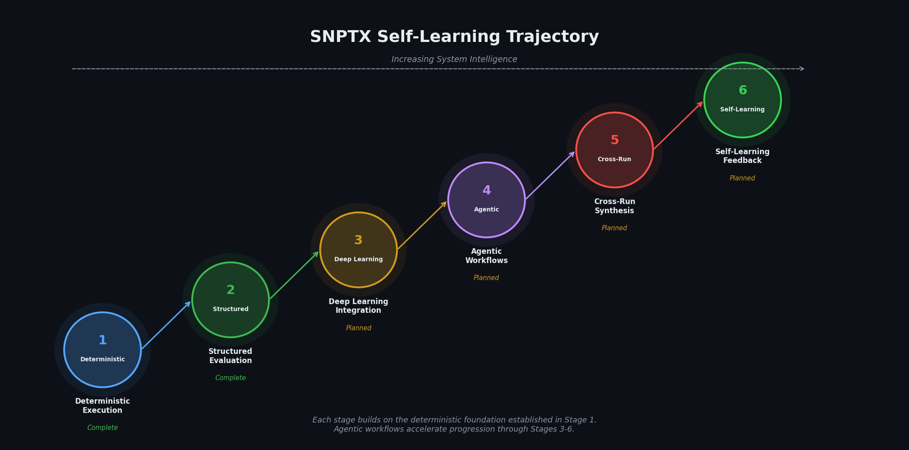

# SNPTX Vision

## Mission

SNPTX exists to accelerate biomedical discovery by providing the infrastructure layer that makes deep learning experimentation reproducible, interpretable, and scalable.

The system is designed for environments where computational results must survive replication: drug target identification, clinical prediction, multi-site consortium research, and regulatory-adjacent analysis. SNPTX provides the orchestration and artifact management that enables researchers to iterate on hypotheses, compare model architectures, and synthesize insights without losing provenance or reproducibility.

## System-Level Intelligence Objective



SNPTX is architected to evolve from a deterministic execution framework into a system capable of structured self-assessment. The long-term objective is not autonomous decision-making, but structured insight synthesis: a system that identifies patterns across its own evaluation outputs, surfaces hypotheses for investigation, and flags anomalies that merit human attention.

The trajectory is deliberate:

1. **Deterministic execution.** The system produces reliable, reproducible outputs. *(Complete)*
2. **Structured evaluation.** Downstream extensions normalize, aggregate, and report on outputs. *(Complete)*
3. **Deep learning integration.** Transformer, GNN, and foundation model pipelines operate within deterministic infrastructure. *(Planned)*
4. **Agentic workflow execution.** Autonomous agents author extensions, execute pipelines, synthesize evaluations, and propose configurations. *(Planned)*
5. **Cross-run synthesis.** The system identifies patterns and anomalies across evaluation histories. *(Planned)*
6. **Hypothesis generation.** Structured suggestions emerge from accumulated evidence. *(Planned)*
7. **Closed-loop feedback.** Insights flow back into pipeline configuration through governed artifact channels. *(Planned)*

This intelligence layer will operate through the same artifact-driven interface as all other extensions. It will not automate retraining without explicit authorization. The feedback loop is advisory and traceable by design.

## Infrastructure as Enabling Layer

SNPTX treats infrastructure not as overhead, but as the enabling layer for ambitious research. The framework is agnostic to model architecture, data modality, and analytical methodology. It provides the structural guarantees within which any learning method can operate with full provenance.

This is a deliberate strategic choice:

- Model architectures change rapidly; infrastructure requirements are stable.
- Reproducibility failures are infrastructure failures, not algorithmic failures.
- Multi-modal, multi-model comparison requires a common orchestration layer.
- Self-learning capabilities require a stable artifact foundation to build on.

The infrastructure does not constrain what researchers can do. It guarantees that what they do can be reproduced, compared, and extended.

## Long-Term Direction

SNPTX is designed to become the standard orchestration layer for reproducible biomedical ML: the infrastructure that research labs, pharmaceutical R&D teams, and multi-site consortia use to run deep learning experiments, compare model architectures, synthesize insights across runs, and generate structured hypotheses for the next cycle of discovery.

The end state is a system where the distance between a research question and a reproducible, publishable computational result is measured in configuration changes, not engineering sprints.

---

## Documentation

For detailed technical architecture, see [ARCHITECTURE.md](ARCHITECTURE.md).  
For the development roadmap, see [ROADMAP.md](ROADMAP.md).  
For the extension development model, see [DEVKIT_NOTES.md](DEVKIT_NOTES.md).  
For strategic positioning, see [POSITIONING.md](POSITIONING.md).  
For market analysis and TAM, see [MARKET_ANALYSIS.md](MARKET_ANALYSIS.md).  

---

## Repository Structure

```
snptx-public/
+-- README.md
+-- docs/
    +-- ARCHITECTURE.md
    +-- ROADMAP.md
    +-- DEVKIT_NOTES.md
    +-- VISION.md
    +-- POSITIONING.md
    +-- INVESTOR_BRIEF.md
    +-- MARKET_ANALYSIS.md
    +-- assets/
        +-- agentic_workflow.png
        +-- discovery_loop.png
        +-- extension_lifecycle.png
        +-- market_growth.png
        +-- multimodal_framework.png
        +-- positioning_matrix.png
        +-- self_learning_trajectory.png
        +-- snptx_architecture.png
        +-- SNPTX_Project_roadmap.png
        +-- tam_sam_som.png
        +-- workflow_dag.png
```

This repository contains documentation and architectural specifications only. Source code, datasets, model artifacts, and execution scripts are maintained in private repositories.

---

## Team

**Dan Russell** (Founder), MITx (SDS), Harvard ALM (DS) '27. Systems architecture, biomedical ML infrastructure.

drr508@g.harvard.edu  
dan@snptx.ai
